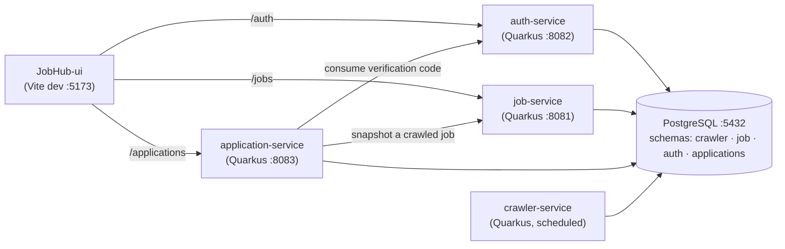

# JobHub

JobHub crawls job postings, lets users browse/search them, and tracks their job
applications with a dashboard of stats. It is a Maven monorepo of three Quarkus 3
(Java 21) backend services plus a React/Vite frontend, all backed by a single
PostgreSQL 16 database with **schema-per-service** isolation.

📖 **Documentation:** **<https://davidrodriguez-create.github.io/JobHub/>** —
architecture, local setup, per-service guides, and a **live API reference** rendered
from the OpenAPI contracts.

## Architecture



### Services

| Service | Port | Description |
|---------|------|-------------|
| **crawler-service** | (internal) | Scheduled batch crawler. Fetches postings into the `crawler` schema. No published HTTP port. |
| **job-service** | 8081 | Browse/search postings, saved jobs, saved filter presets, and facets. |
| **auth-service** | 8082 (root `/auth`) | Registration, login (JWT), account management, email/action verification. |
| **application-service** | 8083 | Track applications + timeline + dashboard stats. Calls job-service (snapshots) and auth-service (verified delete-all). |
| **JobHub-ui** | 5173 | React/Vite frontend. Dev server reverse-proxies `/auth`, `/jobs`, `/applications` to the services. |
| **PostgreSQL** | 5432 | One database (`jobhub`), one schema per service, each with its own least-privilege user. |

The API surface for every service is defined contract-first in
[`api-contracts/`](api-contracts) (OpenAPI). The full docs site renders these
contracts as an interactive API reference — see the documentation link above.

## Quick start with Podman

### Prerequisites
- Podman 5+ with the `podman compose` provider (`podman compose version` should print a Compose version)
- Java 21 + Maven 3.9+ (to package the backend services)

### Run everything

```bash
# 1. Create your local env file (per-service DB users; defaults work out of the box)
cp .env.example .env

# 2. Package the backend services (produces each target/quarkus-app used by the images)
mvn -DskipTests package

# 3. Build the images and start the whole stack
podman compose -f podman-compose.yml up -d --build
```

This starts:
- PostgreSQL on `localhost:5432` (database `jobhub`) — schema + seed data applied on first init
  from `db/init/` and `db/seeds/`; per-service users created by `db/init-users.sh`
- auth-service on `localhost:8082`, job-service on `localhost:8081`, application-service on `localhost:8083`
- crawler-service (background, no published port)
- JobHub-ui on **http://localhost:5173** — the UI runs the Vite dev server via **pnpm** (`VITE_USE_API=true`), so it talks to the live services through its proxy

> Credentials come from `.env` (git-ignored). The committed `.env.example` ships working local
> defaults, so a plain `cp` is enough to get started — never commit a filled-in `.env`.

> On first start the UI container runs `pnpm install` inside a Node 20 container
> (cached in the `ui_node_modules` volume), so it takes a little longer to come up
> than the backend services. Follow it with `podman logs -f jobhub-ui`.

Open **http://localhost:5173**.

### Verify it's up

```bash
curl http://localhost:8081/jobs?size=1            # job-service → 200 (JobSearchPage)
curl -i http://localhost:8083/applications        # application-service → 401 (needs JWT)
curl -X POST http://localhost:8082/auth/register \
  -H 'Content-Type: application/json' \
  -d '{"firstName":"A","lastName":"B","email":"you@example.com","password":"test1234"}'   # → 201
```

### Common commands

```bash
podman compose -f podman-compose.yml ps             # status
podman compose -f podman-compose.yml logs -f auth-service
podman compose -f podman-compose.yml up -d --build job-service   # rebuild one service
podman compose -f podman-compose.yml down           # stop (keep the DB volume)
podman compose -f podman-compose.yml down -v        # stop + WIPE the DB (re-runs db/init + db/seeds next up)
```

> **Schema changes?** Postgres only runs `db/init/` + `db/seeds/` on the **first**
> initialization of an empty data volume. After editing those SQL files, reset with
> `down -v` so they re-apply (otherwise services fail Hibernate `validate` on boot).

For **native** images instead of JVM, package with `-Pnative` and use the native compose file:

```bash
mvn -DskipTests package -Pnative
podman compose -f podman-compose.native.yml up -d --build
```

## Local development (without containers)

```bash
# Each service in dev mode (hot reload). Quarkus DevServices starts a throwaway
# Postgres automatically (podman must be running), applying the dev schema + seeds.
mvn -pl crawler-service quarkus:dev
mvn -pl job-service quarkus:dev
mvn -pl auth-service quarkus:dev
mvn -pl application-service quarkus:dev

# UI in dev mode (mock data by default; set VITE_USE_API=true to hit the services)
cd JobHub-ui && pnpm install && pnpm dev
```

Swagger UI is available per service in dev mode at `http://localhost:<port>/swagger`.

## Configuration

Credentials and connection settings are supplied per service via `.env` (copied from
[`.env.example`](.env.example)). Each service has its **own database user** with access to only
its schema (least privilege):

| Variable group (in `.env`) | Default | Used by |
|----------------------------|---------|---------|
| `CRAWLER_DATABASE_URL` / `_USERNAME` / `_PASSWORD` | `…/jobhub`, `crawler_user` | crawler-service |
| `JOB_DATABASE_URL` / `_USERNAME` / `_PASSWORD` | `…/jobhub`, `job_user` | job-service |
| `AUTH_DATABASE_URL` / `_USERNAME` / `_PASSWORD` | `…/jobhub`, `auth_user` | auth-service |
| `APPLICATIONS_DATABASE_URL` / `_USERNAME` / `_PASSWORD` | `…/jobhub`, `applications_user` | application-service |
| `ADMIN_DATABASE_*` | `jobhub_admin` | migrations / maintenance |
| `JOB_SERVICE_URL` / `AUTH_SERVICE_URL` | `http://job-service:8081` / `…:8082` | application-service |
| `VITE_USE_API` / `VITE_*_TARGET` | `true` / service URLs | jobhub-ui |

### JWT keys

Services authenticate with RS256 JWTs (issuer `jobhub-auth`): auth-service **signs**,
the others **verify**. Keys are **generated at build time** (a `gmavenplus` step in the parent
`pom.xml`) and **never committed**:

- **Main classpath:** one *shared* dev keypair (generated once at the reactor root in `.dev-keys/`)
  is copied into each service so local cross-service auth uses a consistent pair.
- **Tests:** a *fresh ephemeral* keypair per module — each `@QuarkusTest` is isolated and mints
  its own tokens.

In production the key locations are overridden via environment variables to point at the real
deployed keys, so the dev keypair is never used outside local development.
