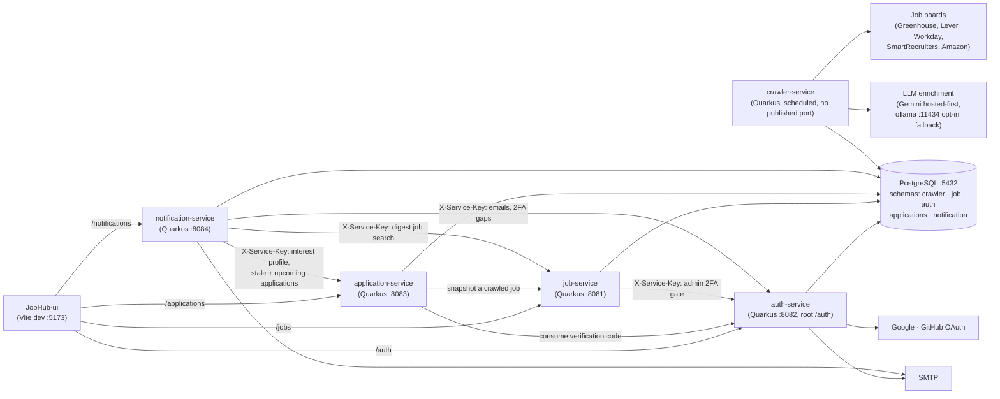

# JobHub

JobHub crawls job postings, lets users browse/search them, tracks their job
applications with a dashboard of stats, and nudges them by email and in-app
notifications. It is a Maven monorepo of five Quarkus 3 (Java 21) backend services
plus a React/Vite frontend, all backed by a single PostgreSQL 16 database with
**schema-per-service** isolation.

📖 **Documentation:** **<https://davidrodriguez-create.github.io/JobHub/>** —
architecture, local setup, per-service guides, and a **live API reference** rendered
from the OpenAPI contracts.

## Architecture



### Services

| Service | Port | Description |
|---------|------|-------------|
| **crawler-service** | (internal) | Scheduled batch crawler. Fetches postings from the job-board clients into the `crawler` schema, normalises locations, and runs the LLM enrichment pass. No published HTTP port. |
| **job-service** | 8081 | Browse/search postings, saved jobs, per-user saved filter presets, facets, company data, and the admin crawl/enrichment triggers. |
| **auth-service** | 8082 (root `/auth`) | Registration, login (JWT), social login (Google/GitHub), TOTP 2FA, apply-profile answer bank, account management, email/action verification. |
| **application-service** | 8083 | Track applications + timeline + dashboard stats. Calls job-service (snapshots) and auth-service (verified delete-all). |
| **notification-service** | 8084 | Preferences API, in-app notification bell, weekly digest email, interview and custom reminders, ghosted alert, security recommendations. Calls auth/application/job over internal `X-Service-Key` endpoints and sends mail over SMTP. |
| **JobHub-ui** | 5173 | React/Vite frontend. Dev server reverse-proxies `/auth`, `/jobs`, `/applications`, `/notifications` to the services. |
| **PostgreSQL** | 5432 | One database (`jobhub`), one schema per service, each with its own least-privilege user. |
| **ollama** *(opt-in)* | 11434 | Local LLM fallback for crawler enrichment. Off by default: needs `--profile ollama` **and** `CRAWLER_OLLAMA_ENABLED=true`. |
| **mailpit** *(opt-in)* | 8025 (UI), 1025 (SMTP) | Local mail catcher for testing digest/reminder emails. Start with `--profile mailpit`. |

The API surface for every service is defined contract-first in
[`api-contracts/`](api-contracts) (OpenAPI). The full docs site renders these
contracts as an interactive API reference: see the documentation link above.

### Health endpoints

Every backend service ships `quarkus-smallrye-health` and exposes `/q/health`,
`/q/health/live` and `/q/health/ready`. Readiness includes the Agroal datasource check,
so a service that is up but cannot reach Postgres reports DOWN. Both compose files probe
`/q/health/ready` per service.

**auth-service is the exception:** it is root-pathed at `/auth` and
`quarkus.http.non-application-root-path` follows it, so its health lives at
**`/auth/q/health/ready`** and the unprefixed path 404s.

```bash
curl -fsS http://localhost:8081/q/health/ready        # job-service
curl -fsS http://localhost:8082/auth/q/health/ready   # auth-service (prefixed!)
curl -fsS http://localhost:8083/q/health/ready        # application-service
curl -fsS http://localhost:8084/q/health/ready        # notification-service
```

crawler-service listens on 8081 inside its container (unpublished), so probe it from
inside: `podman exec jobhub-crawler-service wget -qO- http://localhost:8081/q/health/ready`.

## Quick start with Podman

### Prerequisites
- Podman 5+ with the `podman compose` provider (`podman compose version` should print a Compose version)
- Java 21 + Maven 3.9+ (to package the backend services)

### Run everything

```bash
# 1. Create your local env file (per-service DB users; defaults work out of the box)
cp .env.example .env

# 2. Package the backend services (produces each target/quarkus-app used by the images)
mvn -DskipTests package

# 3. Build the images and start the whole stack
podman compose -f podman-compose.yml up -d --build
```

This starts:
- PostgreSQL on `localhost:5432` (database `jobhub`) — schema + seed data applied on first init
  from `db/init/` and `db/seeds/`; per-service users created by `db/init-users.sh`
- auth-service on `localhost:8082`, job-service on `localhost:8081`, application-service on
  `localhost:8083`, notification-service on `localhost:8084`
- crawler-service (background, no published port)
- JobHub-ui on **http://localhost:5173** — the UI runs the Vite dev server via **pnpm** (`VITE_USE_API=true`), so it talks to the live services through its proxy

> Credentials come from `.env` (git-ignored). The committed `.env.example` ships working local
> defaults, so a plain `cp` is enough to get started — never commit a filled-in `.env`.

> On first start the UI container runs `pnpm install` inside a Node 20 container
> (cached in the `ui_node_modules` volume), so it takes a little longer to come up
> than the backend services. Follow it with `podman logs -f jobhub-ui`.

Open **http://localhost:5173**.

### Verify it's up

```bash
curl http://localhost:8081/jobs?size=1            # job-service → 200 (JobSearchPage)
curl -i http://localhost:8083/applications        # application-service → 401 (needs JWT)
curl -i http://localhost:8084/notifications                # notification-service → 401 (needs JWT)
curl -X POST http://localhost:8082/auth/register \
  -H 'Content-Type: application/json' \
  -d '{"firstName":"A","lastName":"B","email":"you@example.com","password":"test1234"}'   # → 201
```

Optional containers are behind compose profiles and are **not** started by the plain
`up -d` above:

```bash
podman compose -f podman-compose.yml --profile ollama up -d ollama     # local LLM fallback
podman exec jobhub-ollama ollama pull llama3.2                         # once, to fetch the model
podman compose -f podman-compose.yml --profile mailpit up -d mailpit   # mail catcher on :8025
```

### Common commands

```bash
podman compose -f podman-compose.yml ps             # status
podman compose -f podman-compose.yml logs -f auth-service
podman compose -f podman-compose.yml up -d --build job-service   # rebuild one service
podman compose -f podman-compose.yml down           # stop (keep the DB volume)
podman compose -f podman-compose.yml down -v        # stop + WIPE the DB (re-runs db/init + db/seeds next up)
```

> **Schema changes?** Postgres only runs `db/init/` + `db/seeds/` on the **first**
> initialization of an empty data volume. After editing those SQL files, reset with
> `down -v` so they re-apply (otherwise services fail Hibernate `validate` on boot).

For **native** images instead of JVM, package with `-Pnative` and use the native compose file:

```bash
mvn -DskipTests package -Pnative
podman compose -f podman-compose.native.yml up -d --build
```

## Local development (without containers)

```bash
# Each service in dev mode (hot reload). Quarkus DevServices starts a throwaway
# Postgres automatically (podman must be running), applying the dev schema + seeds.
mvn -pl crawler-service quarkus:dev
mvn -pl job-service quarkus:dev
mvn -pl auth-service quarkus:dev
mvn -pl application-service quarkus:dev
mvn -pl notification-service quarkus:dev

# UI in dev mode (mock data by default; set VITE_USE_API=true to hit the services)
cd JobHub-ui && pnpm install && pnpm dev
```

Swagger UI is available per service in dev mode at `http://localhost:<port>/swagger`.

## Configuration

Credentials and connection settings are supplied per service via `.env` (copied from
[`.env.example`](.env.example)). Each service has its **own database user** with access to only
its schema (least privilege):

| Variable group (in `.env`) | Default | Used by |
|----------------------------|---------|---------|
| `CRAWLER_DATABASE_URL` / `_USERNAME` / `_PASSWORD` | `…/jobhub`, `crawler_user` | crawler-service |
| `JOB_DATABASE_URL` / `_USERNAME` / `_PASSWORD` | `…/jobhub`, `job_user` | job-service |
| `AUTH_DATABASE_URL` / `_USERNAME` / `_PASSWORD` | `…/jobhub`, `auth_user` | auth-service |
| `APPLICATIONS_DATABASE_URL` / `_USERNAME` / `_PASSWORD` | `…/jobhub`, `applications_user` | application-service |
| `NOTIFICATION_DATABASE_URL` / `_USERNAME` / `_PASSWORD` | `…/jobhub`, `notification_user` | notification-service |
| `ADMIN_DATABASE_*` | `jobhub_admin` | migrations / maintenance |
| `JOB_SERVICE_URL` / `AUTH_SERVICE_URL` | `http://job-service:8081` / `…:8082` | application-service, job-service |
| `AUTH_/APPLICATION_/JOB_SERVICE_BASE_URL` | the three service URLs | notification-service |
| `VITE_USE_API` / `VITE_*_TARGET` | `true` / service URLs | jobhub-ui |

### Service-to-service calls

Internal endpoints (`/internal/*`, and `/auth/internal/*` on auth-service) are not exposed to
the UI: they are guarded by a pre-shared key sent as the `X-Service-Key` header.

| Variable | Default | Purpose |
|---|---|---|
| `JOBHUB_INTERNAL_SERVICE_KEY` | `dev-internal-service-key` | Must be **identical** in auth-, job-, application- and notification-service. A mismatch makes the digest, reminders and the admin-trigger 2FA gate fail with 401. |
| `AUTH_ADMIN_EMAILS` | empty | Comma-separated allowlist of admins allowed to fire the crawl/enrichment triggers. Empty means no admins. |
| `TOTP_ENCRYPTION_KEY` | dev value in `.env.example` | AES-256-GCM key (64 hex chars) encrypting TOTP secrets at rest. Changing it invalidates every enrolled 2FA secret. |

### Crawler enrichment

The crawler runs a configurable chain of LLM providers over freshly crawled postings
(ADR 0004). It is hosted-first, with the local model as an opt-in fallback.

| Variable | Default | Purpose |
|---|---|---|
| `CRAWLER_ENRICHMENT_ENABLED` | `true` | Master switch. `false` makes the enrichment scheduler a no-op, so no model is ever called. |
| `GEMINI_API_KEY` | empty | Enables the hosted provider. Blank means the chain falls through to the next enabled provider. |
| `CRAWLER_ENRICHMENT_HOSTED_MODELS` | `gemini-3.1-flash-lite,gemma-4-31b-it,gemma-4-26b-a4b-it` | Ordered hosted model chain; the crawler steps down the list on per-model quota exhaustion. |
| `CRAWLER_OLLAMA_ENABLED` | `false` | Local fallback provider. Needs `--profile ollama` as well, otherwise there is nothing at `OLLAMA_BASE_URL`. |
| `CRAWLER_ENRICHMENT_MODEL` | `llama3.2` | Model used by the local Ollama provider. |

### Notification email

`notification-service` sends the weekly digest, interview/custom reminders, ghosted alerts
and security recommendations over SMTP (`NOTIFICATION_MAILER_*` in `.env`). **Real sending is
the default:** with a blank or wrong host the send fails loudly in the logs, it never silently
mocks. Set `NOTIFICATION_MAILER_MOCK=true` only for a throwaway smoke run, or point it at the
`mailpit` profile (`HOST=mailpit`, `PORT=1025`, `START_TLS=DISABLED`, UI on
<http://localhost:8025>). auth-service has its own separate `MAILER_*` block for verification
emails.

### Social login

`OAUTH_REDIRECT_BASE_URL` plus `GOOGLE_OAUTH_CLIENT_ID/SECRET` and
`GITHUB_OAUTH_CLIENT_ID/SECRET` enable social login (ADR 0027/0028). Leaving a provider's
pair blank keeps it disabled: its `GET /auth/oauth/{provider}/start` returns 404 until configured.

### JWT keys

Services authenticate with RS256 JWTs (issuer `jobhub-auth`): auth-service **signs**,
the others **verify**. Keys are **generated at build time** (a `gmavenplus` step in the parent
`pom.xml`) and **never committed**:

- **Main classpath:** one *shared* dev keypair (generated once at the reactor root in `.dev-keys/`)
  is copied into each service so local cross-service auth uses a consistent pair.
- **Tests:** a *fresh ephemeral* keypair per module — each `@QuarkusTest` is isolated and mints
  its own tokens.

In production the key locations are overridden via environment variables to point at the real
deployed keys, so the dev keypair is never used outside local development.
