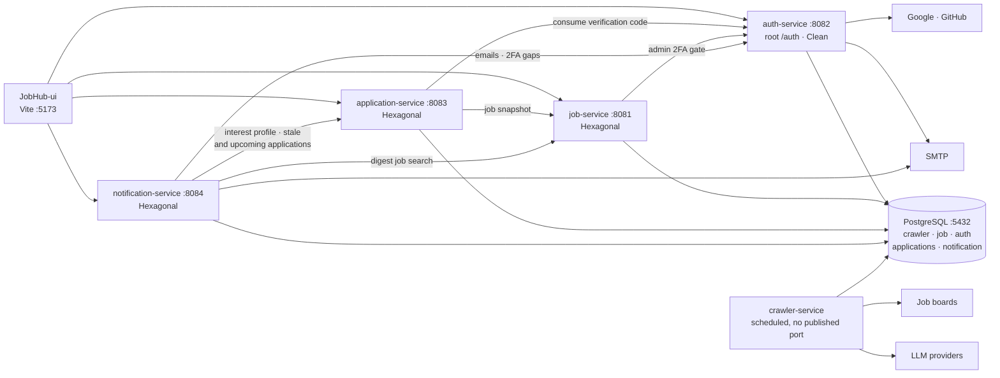

# Architecture overview

JobHub is five Quarkus 3 (Java 21) backend services, a React/Vite frontend, and one PostgreSQL 16
database with **schema-per-service** isolation. This page is the high-level design: the runtime
topology, how services talk to each other, the contract-first API flow, and the two internal
architectures we use per service.

## System topology



### Who owns what

| Service | Owns (schema) | Shape |
|---|---|---|
| `crawler-service` | `crawler` (sole writer of `job_post` and `pull_target`) | 4 schedulers, 5 job-board clients, an LLM provider chain, no inbound REST |
| `job-service` | reads `crawler`, writes `crawler.saved_job` / `saved_filter` / `trigger_request` / `company` | REST read API + admin triggers + one outbound client (auth) |
| `auth-service` | `auth` | REST API, 4 outbound OAuth clients, SMTP mail |
| `application-service` | `applications` | REST API, 2 outbound clients (job, auth) |
| `notification-service` | `notification` | REST API, 5 schedulers, 3 outbound client groups, Qute mail adapter |

The `job` schema exists but is currently empty: job-service reads and writes the `crawler` schema
directly rather than duplicating postings. That is a deliberate cross-schema read, and it is why
`db/init/010-crawler.sql` ends with explicit least-privilege grants to `job_user`: `SELECT` on
`crawler.job_post` and `crawler.pull_target`, full DML on `crawler.saved_job` and
`crawler.saved_filter`.

`crawler.company` lives in the crawler schema but is **job-service territory**: crawler-service
maps no company entity at all. job-service creates and updates company rows, derives the logo
from the source slug, and stamps provenance on admin edits (ADR 0023, 0024, 0025).

### Communication rules

- **The UI only ever talks to public, JWT-authenticated endpoints**, proxied by Vite on
  `/auth`, `/jobs`, `/applications`, `/notifications`.
- **Service-to-service calls use `/internal/*` endpoints** guarded by the pre-shared
  `X-Service-Key` header (`JOBHUB_INTERNAL_SERVICE_KEY`, identical across services). These carry
  no user JWT and are never reachable through the UI proxy.
- **auth-service is root-pathed at `/auth`.** Every client of it, including health probes, must
  bake the prefix in: `/auth/internal/users/emails`, `/auth/q/health/ready`. Forgetting this is a
  silent 404, not an error at startup.
- **One cross-service hop is deliberately database-mediated:** job-service's admin trigger writes
  a row into `crawler.trigger_request`, and crawler-service's `TriggerRequestScheduler` polls for
  it. There is no HTTP path from job-service to crawler-service (ADR 0003, 0006, 0029, 0032).

### Contract-first API flow

`api-contracts/src/main/resources/openapi/*.yaml` is the single source of truth for every service
API. The `openapi-generator-maven-plugin` generates **interface-only** JAX-RS APIs plus
Jackson/Bean-Validation models into `com.davidcreate.jobhub.<svc>.contract.{api,model}`; the
service implements the interface, so a contract change that a service has not implemented is a
compile error rather than a runtime surprise.

External APIs we *consume* live here too (for example `ollama.yaml`), generated models-only. The
`@RegisterRestClient` interface always stays in the consuming service: a REST client cannot
inherit JAX-RS methods from a non-indexed dependency jar.

Operations and properties carry `x-implementation-status: existing | planned`, so a spec can
describe planned surface without implying it is live.

!!! warning "A shared response type has more than one consumer"
    Changing a schema used by several services compiles fine under a scoped
    `mvn -pl <service>` build and still breaks the reactor. Run a full `mvn verify` after any
    `api-contracts` change.

## Two architectures, on purpose

Pick based on complexity and whether domain logic dominates.

| Architecture | Use when | Services |
|---|---|---|
| **[Hexagonal](hexagonal.md)** | Technical service: few, mechanistic use cases where REST/persistence are the main complexity | `job-service`, `crawler-service`, `application-service`, `notification-service` |
| **[Clean](clean.md)** | Complex domain: rich business rules, entities with state, many interrelated use cases where domain logic dominates | `auth-service` (identity, permissions, sessions, token lifecycle) |

### The shared principle

Both architectures enforce the same core rule: **source-code dependencies point inward, toward the
domain.** Frameworks (Quarkus, Panache, JAX-RS) live at the edges; the domain never imports them.

- Domain classes carry **zero framework annotations**: no JPA, no CDI, no JAX-RS.
- Outer layers implement interfaces defined by inner layers.
- DTOs exist only at boundaries; entities only at the persistence edge.

### How they differ

```
Hexagonal                                   Clean (auth)
(job/crawler/application/notification)
───────────────────────────────────────     ───────────────────────────────
domain/                                     domain/        (entities + pure services)
  model/  port/in,out/  service/            application/   (use cases + ports)
adapter/in/rest|scheduler                   adapter/in/rest, out/persistence
adapter/out/persistence|client
one use-case interface per endpoint         one Command/Handler/Response per use case
```

Hexagonal maps REST endpoints one-to-one to use cases. Clean adds an explicit **use-case layer**
(Command → Handler → Response) so business rules and entity state have room to live.

See the dedicated pages for the full layering rules and worked examples:
[Hexagonal](hexagonal.md) · [Clean](clean.md).

### Per-service variations within Hexagonal

The layering rules are identical; what differs is which adapters exist.

- **`job-service`** is the plain case: `adapter/in/rest` over `adapter/out/persistence`, plus one
  outbound client to auth-service for the admin-trigger 2FA gate. No WireMock before that client
  existed; it needs one now.
- **`crawler-service`** has no inbound REST at all. Its inbound side is `adapter/in/scheduler`
  (crawl, enrichment, trigger polling, trigger reaping), and `adapter/out/client` is grouped by
  purpose: `client/source/` for the job-board clients, `client/enrichment/` for the LLM provider
  chain, `client/support/` for parsers, converters and normalisers.
- **`application-service`** organises its inner layer as use-case handlers under
  `application/usecase/` with `application/port/{in,out}/` and
  `domain/{entity,valueobject,exception}/`. It has outbound clients to job-service and
  auth-service, so its tests need WireMock.
- **`notification-service`** is the widest: five schedulers on the inbound side (weekly digest,
  interview reminders, custom reminders, ghosted alert, security recommendations), three outbound
  client groups (`adapter/out/client/{auth,application,job}/`) hitting `X-Service-Key` endpoints,
  and a Qute-templated mail adapter in `adapter/out/mail/`. WireMock plus a split surefire run
  (unit / component / `@TestProfile`) over one shared DevServices container.

### Testing by layer

| Layer | Test type | Mocks |
|---|---|---|
| Domain model, DTO, mapper | JUnit 5 (plain) | none |
| Domain service / use-case handler | JUnit 5 + Mockito | repositories, ports |
| REST + persistence adapters | `@QuarkusTest` + DevServices Postgres | none (real DB) |
| Adapter failure paths | `@QuarkusTest` + `@InjectMock` | the repository or client |
| Outbound REST clients | `@QuarkusTest` + WireMock | the remote service |

Full detail: [Development → Testing](../development/testing.md).

## Decision records

Every non-obvious structural choice is an ADR under
[`docs/architecture/adr/`](adr/index.md). The ones landed since this page was last rewritten:

| ADR | Decision | Touches |
|---|---|---|
| [0025](adr/0025-company-admin-enrichment.md) | Admin company enrichment: a record-level manual-edit override protects hand-curated fields from later automatic writes | job-service, api-contracts, UI |
| [0026](adr/0026-automatic-company-enrichment.md) | Automatic company enrichment (crawler infers, job-service writes `source='derived'`). **Superseded** by story #484: the slice never ran in any environment (`JOB_SERVICE_BASE_URL` was never wired into either compose file) and was deleted rather than fixed | crawler-service, job-service |
| [0027](adr/0027-social-login-oauth.md) | Social login via OAuth authorization-code for Google and GitHub, alongside email/password. First outbound REST clients in auth-service | auth-service, api-contracts, db/init, UI |
| [0028](adr/0028-oauth-provider-availability-and-jit-names.md) | An unconfigured provider is a first-class state (404 on `/start`, hidden in the UI) instead of a config crash, plus just-in-time name provisioning | auth-service, api-contracts, UI |
| [0029](adr/0029-crawl-run-visibility.md) | Crawl-run visibility: SQL-level chatter moves off INFO, per-target new-post counts, live progress written to `crawler.trigger_request` | crawler-service, job-service, UI |
| [0030](adr/0030-per-user-saved-filters-and-comp-filter-removal.md) | Saved search filters become per-user server state instead of a browser-global `localStorage` key; the compensation filter leaves the UI | UI (read-only for job-service) |
| [0031](adr/0031-notification-category-taxonomy.md) | A notification's category is derived from its type, so rows render correctly without a job-title lookup succeeding | notification-service, api-contracts, UI |
| [0032](adr/0032-crawler-shutdown-safe-scheduling.md) | Crawler schedulers observe `ShutdownEvent` and drain; stranded `running` trigger rows are reaped, with per-kind last-run time and origin surfaced | crawler-service, job-service, api-contracts, db/init |

Earlier decisions still in force, grouped by area, are listed in the
[ADR index](adr/index.md).
